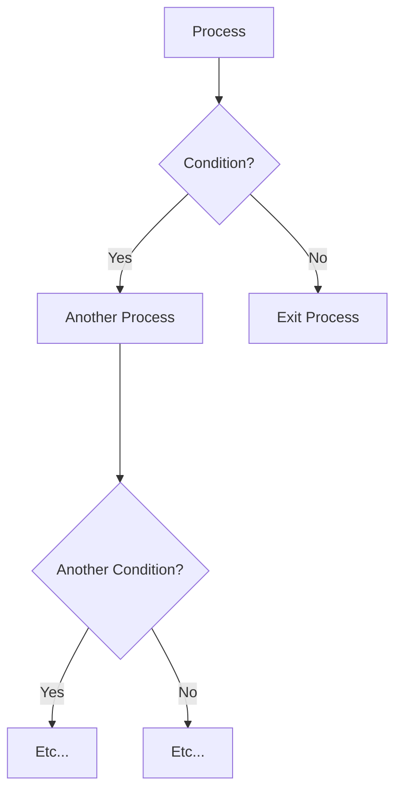
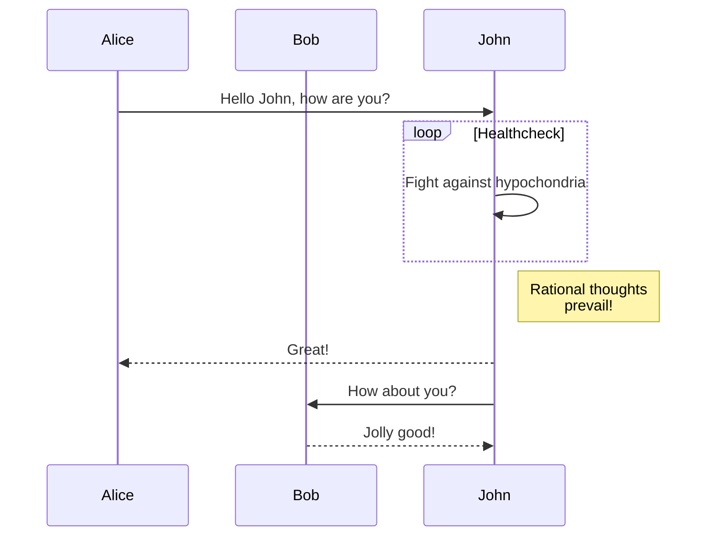
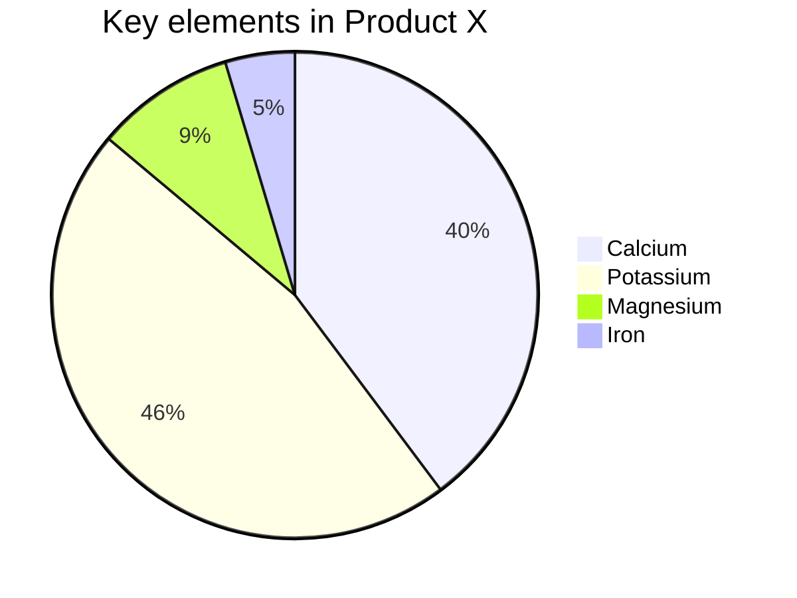
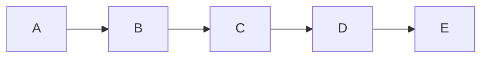
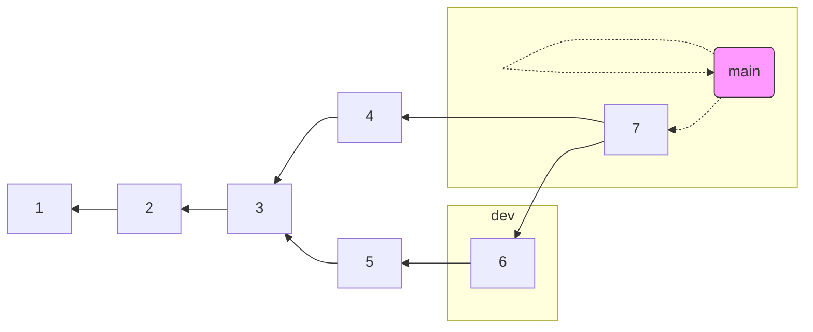
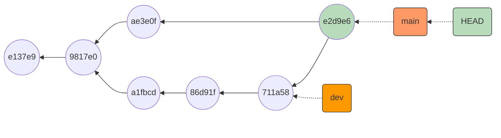

# nuevoborrar

# mermaid
[Include diagrams in your Markdown files with Mermaid](https://github.blog/2022-02-14-include-diagrams-markdown-files-mermaid/)   

[Mermaid website](https://mermaid-js.github.io/mermaid/) 

Con enlaces incluidos

Git detailed graph as a flowchart:

    
